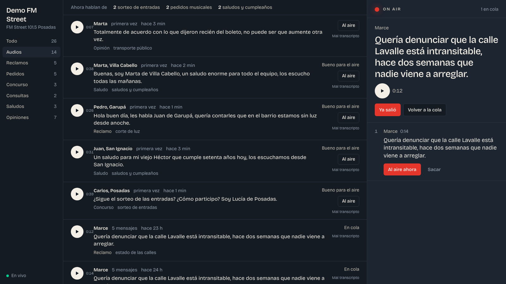

# Radio Chat

A live production room for radio and TV shows. Audiences send thousands of WhatsApp messages during a broadcast — most of them voice notes nobody has time to listen to. Radio Chat ingests them, transcribes the audio, classifies each message with an LLM and streams everything to a board where the producer picks what goes on air in seconds.



## What it does

- **Ingests** WhatsApp messages (text, voice notes, images, video, documents) through a provider adapter. Today: Evolution API (QR pairing). Planned: WhatsApp Cloud API.
- **Transcribes** voice notes with a pluggable speech-to-text driver (AssemblyAI, Deepgram, OpenAI) and ships a benchmark command to compare them on your own audio.
- **Classifies** every message in two tiers. Typed decisions — intent (complaint, song request, greeting, opinion, contest, question, spam), sentiment, an "on-air score" and moderation flags — come from a decision model (TypeSafe's Jev) that returns calibrated probabilities in about a second for a fraction of a cent per thousand messages. Anything that needs generated text — topic, location, listener name, a one-line summary — goes to Claude through tool calling with a strict schema, and only for messages worth the cost. Low-confidence decisions are surfaced to the producer as "review" instead of being decided silently.
- **Streams** each pipeline step to the browser over websockets, so a voice note appears instantly and fills in as it is transcribed and classified.
- **On-air board**: the producer queues messages; the host sees the current one teleprompter-style with a one-click audio player.

## Architecture

```
WhatsApp ── provider webhook ──▶ Laravel
                                   │  IngestMessageJob      (queue: ingest)   idempotent by provider message id
                                   │  DownloadMediaJob      (queue: media)    retries with backoff
                                   │  TranscribeMessageJob  (queue: stt)      driver: assemblyai | deepgram | openai | fake
                                   │  ClassifyMessageJob    (queue: classify) driver: jev (hybrid) | anthropic | fake
                                   ▼
                       PostgreSQL 17 + pgvector ── Reverb (websockets) ──▶ React board
```

- Laravel 13, PHP 8.4, Horizon on Redis, Reverb, PostgreSQL 17 with pgvector, React 19 + Vite + Tailwind 4.
- Every external dependency sits behind an interface (`App\Wa\WaProvider`, `App\Stt\Transcriber`, `App\Classify\Classifier`); switching vendors is one line in `.env`.
- Jobs are idempotent and each stage broadcasts `message.updated`, so the UI never polls.
- `fake` drivers make the whole pipeline runnable with no API keys.

## Run it locally

```bash
docker compose up -d                  # postgres :5434, redis :6390, evolution api :8101
cp .env.example .env && php artisan key:generate
composer install && npm install && npm run build
php artisan migrate
php artisan radio:setup "Morning Show" --station="My Station" --context="Hosts, segments, topic of the day"

php artisan serve --host=0.0.0.0 --port=8100    # board at http://localhost:8100
php artisan horizon                              # queues at /horizon
php artisan reverb:start --port=8102             # websockets
```

Without WhatsApp: `php artisan radio:fake-burst 20 --audio-dir=path/to/audios`

With WhatsApp: open `http://localhost:8100/wa`, scan the QR (it refreshes itself) and send a voice note to that number.

## Commands

| Command | Purpose |
|---|---|
| `wa:connect`, `wa:status` | Pair and check the WhatsApp session |
| `stt:benchmark <dir>` | Transcribe the same files with every configured STT vendor; prints text, latency and estimated cost |
| `radio:reprocess [--stt]` | Re-run transcription and/or classification, e.g. after changing drivers |
| `radio:fake-burst <n>` | Generate a burst of fake messages to exercise the board |
| `radio:setup` | Program name, station and the context injected into the classifier prompt |

## Roadmap

Embedding-based topic clustering · audience analytics (locations, returning listeners, weekly topics) · WhatsApp Cloud API adapter · authentication and private channels · media retention · monthly partitioning of `messages`.

## Status

Working demo, built as the first version of a product for local radio stations in Argentina. The UI is in Spanish.
